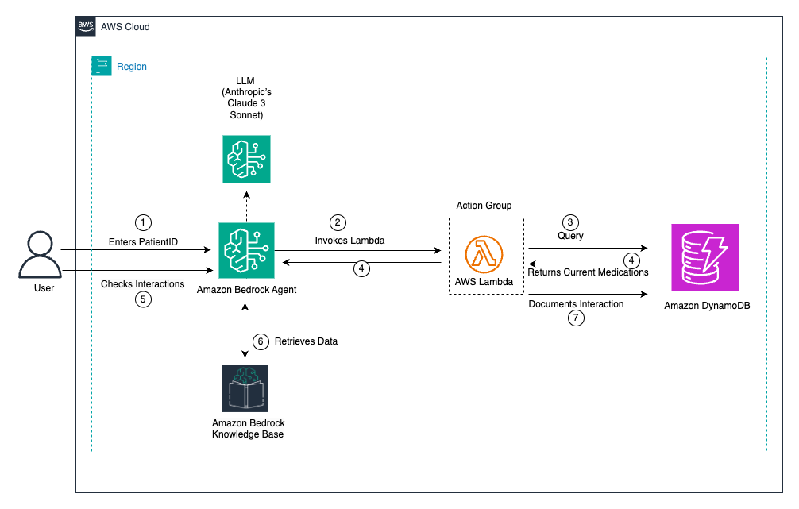

# Prescription Validation System with Amazon Bedrock and DynamoDB

A healthcare solution that enables real-time prescription validation and drug interaction checking using Amazon Bedrock and DynamoDB.

## Overview

This solution implements a prescription validation system that enables healthcare providers to check drug interactions through natural language conversations. The system combines the power of DynamoDB's single-digit millisecond performance with Amazon Bedrock's conversational capabilities.

## Architecture

The following architecture diagram illustrates how healthcare providers interact with this data model through the prescription validation agent.



The solution consists of:
- DynamoDB table with composite key design (PatientID, RecordType)
- Amazon Bedrock agent for prescription validation
- AWS Lambda function for data operations
- Amazon Bedrock knowledge base for medication data

### Workflow
1. Provider queries agent with patient ID and proposed medication
2. Agent invokes Lambda function
3. Lambda retrieves current medications from DynamoDB
4. Agent evaluates interactions using knowledge base
5. Provider receives results and can request documentation
6. Lambda records interaction check in DynamoDB

## Lambda Function Architecture

The Lambda function serves as the critical bridge between the Amazon Bedrock agent and the DynamoDB database in this prescription validation system. Here's a detailed look at its functionality:

### Key Lambda Function Components

1. **Data Retrieval Operations**
   - Fetches patient medication records using PatientID as the partition key
   - Implements efficient query patterns to retrieve only relevant medication data
   - Uses DynamoDB's single-digit millisecond performance for real-time responses

2. **Data Processing Logic**
   - Formats medication data for the Bedrock agent to process
   - Structures interaction check requests for the knowledge base
   - Transforms raw DynamoDB items into meaningful clinical information

3. **Record Management**
   - Creates audit trail entries for each interaction check
   - Stores new prescriptions when approved
   - Maintains historical record of all medication validations

### Lambda Function Workflow

```
┌─────────────────┐     ┌─────────────────┐     ┌─────────────────┐
│                 │     │                 │     │                 │
│  Bedrock Agent  │────▶│ Lambda Function │────▶│    DynamoDB     │
│                 │     │                 │     │                 │
└─────────────────┘     └─────────────────┘     └─────────────────┘
        ▲                       │                       │
        │                       │                       │
        └───────────────────────┴───────────────────────┘
                          Response Flow
```

## Amazon Bedrock Agent OpenAPI Integration

The Amazon Bedrock agent uses [OpenAPI](https://docs.aws.amazon.com/bedrock/latest/userguide/agents-api-schema.html) specifications to define the interface between the natural language processing capabilities and the Lambda function.

### OpenAPI Schema

The OpenAPI schema defines:

1. **API Endpoints**
   - `/getMedications` - Retrieves current medications for a patient
   - `/checkInteractions` - Validates potential drug interactions
   - `/recordPrescription` - Records new approved prescriptions
   - `/getInteractionHistory` - Retrieves historical interaction checks

2. **Request Parameters**
   - PatientID (required)
   - Medication name (required for interaction checks)
   - Dosage information (optional)
   - Prescriber information (optional)

3. **Response Formats**
   - Structured medication lists
   - Interaction check results with severity levels
   - Confirmation of recorded prescriptions
   - Error responses with descriptive messages

### Agent Action Groups

The Bedrock agent is configured with action groups that map to specific API operations:

1. **Medication Retrieval Group**
   - Handles queries about current medications
   - Maps natural language to structured API calls
   - Formats responses for healthcare provider consumption

2. **Interaction Validation Group**
   - Processes requests to check drug interactions
   - Leverages knowledge base for medical validation
   - Provides detailed interaction information

3. **Prescription Management Group**
   - Handles requests to record new prescriptions
   - Validates input data before storage
   - Confirms successful recording of prescriptions


## Prerequisites

- [AWS CLI installed and configured](https://docs.aws.amazon.com/cli/latest/userguide/getting-started-install.html)
- [Terraform installed](https://developer.hashicorp.com/terraform/tutorials/aws-get-started/install-cli)
- [Git installed](https://git-scm.com/downloads)
- Amazon Bedrock knowledge base set up with a structured data store. Use the following:
  - [Prerequisites for creating an Amazon Bedrock knowledge base with a structured data store](https://docs.aws.amazon.com/bedrock/latest/userguide/knowledge-base-prereq-structured.html)
  - [Create a knowledge base by connecting to a structured data store](https://docs.aws.amazon.com/bedrock/latest/userguide/knowledge-base-structured-create.html)
- Note down the Knowledge base ID

Note: This solution uses Amazon Redshift as the structured data store for the knowledge base, with data loaded from an Amazon S3 bucket created during the Terraform deployment.


## Deployment

1. Clone the repository:

2. Update Knowledge Base Id in variables.tf file with Knowledge Base ID:
```bash
cd prescription-validation-with-Bedrock-using-DynamoDB/main-modules
```

```bash
# In main-module/variables.tf
variable "kb_id" {
  description = "KB ID of Redshift"
  type        = string
  default     = " " # Replace with your noted ID 
}
```

3. Deploy with Terraform
```bash
terraform init
terraform plan
terraform apply
```

4. Get the S3 bucket name deployed by terraform The bucket name will be in format:` bedrock-agent-kb-{8 digit-random-suffix}`
   - Navigate to S3 in AWS Console
    - Look for bucket with pattern: bedrock-agent-kb-{8 digit-random-suffix}

5.	Load data from file sample_medical_validation.json present in S3 bucket in Amazon Redshift. Follow [Loading data from Amazon S3](https://docs.aws.amazon.com/redshift/latest/mgmt/query-editor-v2-loading-data.html) into an existing or new table in Amazon Redshift.

6.	[Allow your Amazon Bedrock Knowledge Bases service role to access your data store](https://docs.aws.amazon.com/bedrock/latest/userguide/knowledge-base-prereq-structured-db-access.html)

7.	[Sync your structured data store with your Amazon Bedrock knowledge base](https://docs.aws.amazon.com/bedrock/latest/userguide/kb-data-source-structured-sync-ingest.html)

8. Associate the knowledge base with the agent created by terraform ‘terraformPrescriptionValidation-namecheck-update-agent’. For more information, follow [Augment response generation for your agent with knowledge base](https://docs.aws.amazon.com/bedrock/latest/userguide/agents-kb-add.html) to add a knowledge base to the agent.

## Features

- Real-time prescription validation
- Natural language interaction
- Efficient medication record management
- Comprehensive audit trail
- Professional boundary maintenance
- Structured interaction results

## Data Model

The DynamoDB table uses:
- Partition key: PatientID
- Sort key: Medication
- Interaction check history

## Limitations

- Uses sample knowledge base (needs real medical data)
- Basic interaction checking only
- No dosage-specific validations
- Limited to simple drug combinations

## Cleanup

Remove deployed resources:
```bash
terraform destroy
```

## Additional Resources

- [Data modeling for DynamoDB tables](https://docs.aws.amazon.com/amazondynamodb/latest/developerguide/data-modeling.html)
- [Using generative AI with DynamoDB](https://docs.aws.amazon.com/amazondynamodb/latest/developerguide/ddb-ai-integration.html)
- [Amazon DynamoDB data models for generative AI chatbots](https://aws.amazon.com/blogs/database/amazon-dynamodb-data-models-for-generative-ai-chatbots/)
- [Data modeling building blocks in DynamoDB](https://docs.aws.amazon.com/amazondynamodb/latest/developerguide/data-modeling-blocks.html)


## Contributing

See [CONTRIBUTING](CONTRIBUTING.md#security-issue-notifications) for more information.

## License
This library is licensed under the MIT-0 License. See the LICENSE file.

